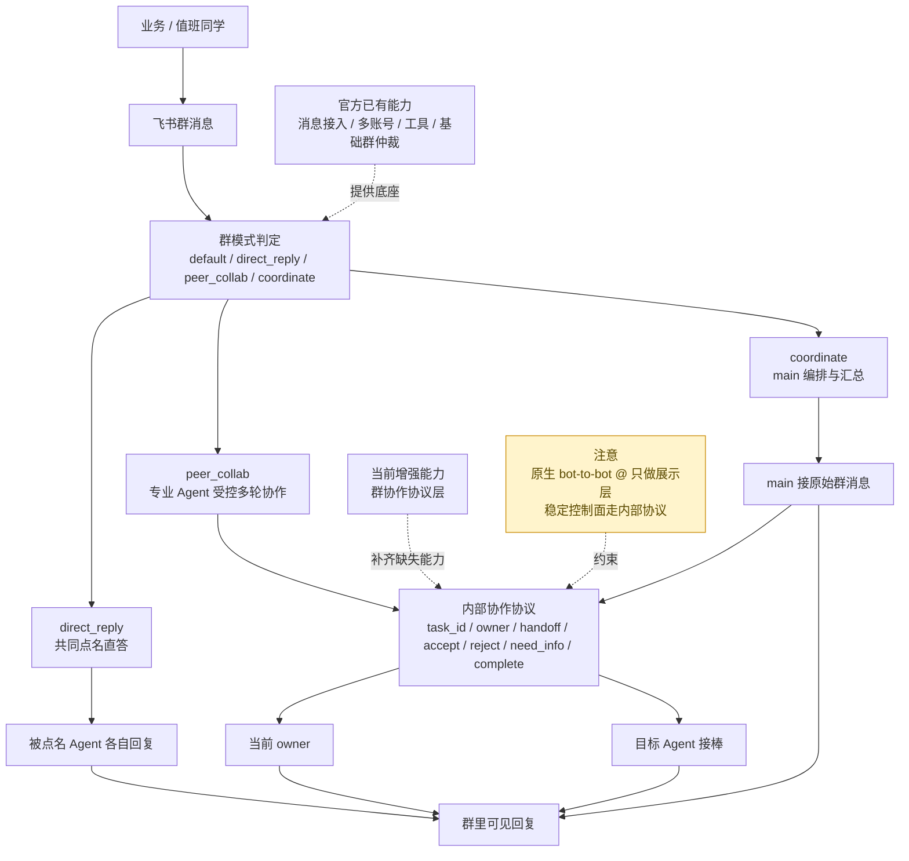
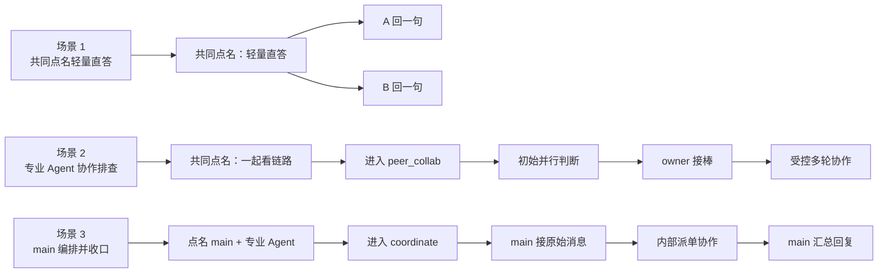

# OpenClaw 飞书插件

这是一个基于 OpenClaw 官方飞书/Lark 插件持续增强的独立源码仓库。

这个仓库解决的重点不是飞书基础接入，而是 `多账号 + 群聊协作 + 多 Agent 协议` 这条生产主线。当前本地运行中的飞书插件代码，已经以这个仓库为准并同步到本机 OpenClaw 安装目录。

## 这是什么

这个插件在保留官方飞书插件基础能力的前提下，重点补了 **群聊里的多 Agent 协作协议**。

官方 stock 飞书插件能做的事情主要是：
- 飞书消息接入
- 多账号配置
- 文档、知识库、云盘、多维表等工具
- 基础群仲裁和 `requireMention`

它不解决的核心问题是：
- 同时点名多个内部 Agent 时怎么分流
- 复杂问题时多个 Agent 怎么协作，而不是抢答
- `main` 怎么在群里编排，专业 Agent 怎么接棒
- 多轮协作时怎么避免串身份、乱 `@`、重复回复、内部控制块泄漏

这个增强版插件补的就是这一层。

当前增强能力包括：
- 多账号飞书接入
- 文档、知识库、云盘、权限等工具能力
- 群消息仲裁与多 Agent 群协作协议
- `main` 默认入口、专业 Agent 显式点名、共同点名直答
- `peer_collab / coordinate` 两类复杂协作模式
- `peer_collab` 下的持续下钻与受控多轮接棒
- owner、handoff、accept/reject/need_info/complete 协作状态机
- `channels.feishu.collaboration.maxHops` 下钻深度控制
- 流式回复去重、内部控制块剥离、错误 `@` 清洗
- 群参与者视图 `feishu_chat(action="participants")`

## 推荐使用方式：显式模式优先

这版插件已经保留自然语言兼容判定，但生产主路径不再建议依赖“让系统猜这次是不是协作”。

推荐直接在群消息里声明模式：

- `#直答`
- `#协作`
- `#编排`

最小例子：

```text
@Flink-SRE @Starrocks-SRE #直答 你俩各用一句话说下你们先看什么
```

```text
@Flink-SRE @Starrocks-SRE #协作 你俩讨论什么是灵魂，先各自判断，再互相补充，最后形成一句结论
```

```text
@首席大管家 @Flink-SRE @Starrocks-SRE #编排 帮我安排并汇总这次排查
```

原因只有一句：
- 自然语言是开放集
- 协作模式是控制协议
- 用开放集去驱动控制协议，本身就不稳

所以当前最佳实践是：
1. 显式模式作为生产主路径
2. 自然语言分类只作为兼容层

## 架构图



这张图对应的核心判断只有一句：**官方 stock 插件解决“飞书接入”，当前增强版插件解决“群里多个 Agent 如何稳定协作”。**

## 解决了哪些真实痛点

### 痛点 1：每次只能 @ 一个 Agent

原生体验里，多数情况下只能把群消息稳定交给一个 bot。

增强后可以支持：
- 同时点名多个内部 Agent
- 轻量问题各自直答
- 复杂问题进入 `peer_collab` 或 `coordinate`

### 痛点 2：@A @B 时，A 也会继续 @B，群里越聊越乱

原生飞书群里的 visible `@` 更适合展示，不适合做稳定控制面。

增强后：
- 共同点名直答和复杂协作严格区分
- 流式输出只做一次可见收口
- 内部控制块不会再直接泄漏到群里
- 不再把一轮共同点名误做成无限互相 `@`

### 痛点 3：A 想让 B 接手，但 B 根本接不到

原生 bot-to-bot `@` 在飞书群里不是可靠控制面。

增强后不再依赖原生 `@` 做接棒，而是：
- 群里保留可见协作感
- 内部用 `owner + handoff + accept/reject/need_info/complete` 做真实接棒

### 痛点 4：复杂任务时，main 和专业 Agent 经常抢答

增强后把群消息分成 4 种模式：
- `default`
- `direct_reply`
- `peer_collab`
- `coordinate`

这使得：
- 简单问题可以直接答
- 复杂问题可以协作
- 明确要求汇总时只由 `main` 收口

## 和官方 stock 插件的差异

| 维度 | 官方 stock 飞书插件 | 当前增强版插件 |
|---|---|---|
| 飞书消息接入 | 支持 | 支持 |
| 多账号 | 支持 | 支持 |
| 文档/知识库/云盘/多维表 | 支持 | 支持 |
| 群 allowlist / `requireMention` | 支持 | 支持 |
| 多 Agent 共同点名分流 | 不完整 | 支持 |
| 共同点名直答 | 无明确协议 | 支持 |
| `main` 编排模式 | 无明确协议 | 支持 |
| 多专业 Agent 受控多轮协作 | 不支持 | 支持 |
| owner / handoff | 不支持 | 支持 |
| 群参与者视图 | 不支持 | 支持 `participants` |
| 原生 bot-to-bot `@` 作为控制面 | 不可靠 | 不依赖，改为内部协作协议 |

## 典型场景



### 场景 1：共同点名，轻量直答

```text
@Flink-SRE @Starrocks-SRE #直答 一个字描述下 john
```

预期：
- 两个 Agent 各答一句
- 不创建协作任务

### 场景 2：多个专业 Agent 协作排查

```text
@Flink-SRE @Starrocks-SRE #协作 你俩一起看下这条链路，先各自说判断，再互相补充
```

预期：
- 进入 `peer_collab`
- 可以持续下钻
- 默认最多接棒 `3` 次
- 不是各说一句就结束

### 场景 3：main 编排并收口

```text
@首席大管家 @Flink-SRE @Starrocks-SRE #编排 帮我安排并汇总这次排查
```

预期：
- 进入 `coordinate`
- 只有 `main` 处理原始消息
- 专业 Agent 通过内部协作参与
- 最终由 `main` 汇总

### 场景 4：群机器人参与者盘点

```text
@首席大管家 这个群里有多少机器人？
```

预期：
- 不再错误回答“没有其他机器人”
- 使用 `feishu_chat(action="participants")` 给出：
  - Feishu 可见人类成员
  - 当前 OpenClaw 内部机器人参与者

## 参数兼容性

当前结论：**配置参数层面，基本兼容原生 OpenClaw 飞书插件。**

理由：

- 本仓库继续使用官方的 `channels.feishu` 配置 schema
- `defaultAccount`、`dmPolicy`、`groupPolicy`、`groupAllowFrom`、`requireMention`、`renderMode`、`streaming`、`tools.*` 等原生参数都仍然有效
- 没有另起一套新的配置 DSL
- 已有增强主要发生在运行时群协作协议和工具行为上，而不是配置字段重定义

当前是**增量增强**，不是**破坏性替换**。

需要明确的差异：

- 新增了 `feishu_chat(action="participants")` 视图，用来回答“这个群里有哪些可见成员和内部机器人参与者”
- 群协作协议新增了 `direct_reply / peer_collab / coordinate` 行为分流，但这不是新的配置字段，而是运行时行为增强
- 新增了 `channels.feishu.collaboration.maxHops`，用来限制 `peer_collab / coordinate` 下的结构化接棒深度
- 新增了显式模式标签 `#直答 / #协作 / #编排`，用于稳定驱动群协作协议；未使用标签时仍保留自然语言兼容层

### 持续下钻与 `maxHops`

当前增强版支持“受控多轮下钻”，但不是无限互相转发。

约束规则：
- 只限制结构化 `agent_handoff` 深度
- 不限制初始并行判断
- 不统计失败或被拒绝的 handoff
- 只统计成功 `accept` 的接棒次数

默认值：

```json
{
  "channels": {
    "feishu": {
      "collaboration": {
        "maxHops": 3
      }
    }
  }
}
```

也支持按账号单独覆盖：

```json
{
  "channels": {
    "feishu": {
      "collaboration": {
        "maxHops": 3
      },
      "accounts": {
        "main": {
          "collaboration": {
            "maxHops": 2
          }
        }
      }
    }
  }
}
```

含义：
- `maxHops=1`：只允许一次成功接棒，适合非常保守的协作
- `maxHops=3`：当前默认值，适合多数群排障场景
- 更大的值只在你确认 prompt、owner 和 handoff 行为已经稳定时再开

兼容边界：

- 这份兼容判断以 `openclaw@2026.3.8` / `@openclaw/feishu@2026.3.8-beta.1` 为基线
- 如果未来 upstream 大改 `configSchema` 或群协作逻辑，需要重新做一次兼容审计

## 当前支持的群聊协作模式

### 1. `default`
- 无 `@`
- 只有 `main` 作为默认入口处理

### 2. `direct_reply`
- 共同点名多个 Agent，但问题只是轻量直答
- 每个被点名 Agent 只代表自己回答
- 不创建任务，不发生 handoff
- 推荐触发方式：`@A @B #直答 ...`

### 3. `peer_collab`
- 同时点名多个内部专业 Agent，并要求一起看、互相补充、继续讨论
- 会创建协作任务
- 允许 owner、handoff、accept/reject/need_info/complete
- 用于“多个专业 Agent 受控多轮协作”
- 推荐触发方式：`@A @B #协作 ...`

### 4. `coordinate`
- 明确要求 `main` 安排、协调、汇总、拉通
- 只有 `main` 处理原始群消息
- 其他 Agent 通过内部协作参与
- 推荐触发方式：`@main @A @B #编排 ...`

### 5. 自然语言兼容层
- `@main + 安排/协调/汇总` 倾向 `coordinate`
- 明显轻量直答句式倾向 `direct_reply`
- 其余多 bot 共同点名倾向 `peer_collab`

这条路径保留是为了兼容历史用法，不承诺和显式模式一样稳定。

更细的协议细节见：
- [能力与兼容性](docs/01-能力与兼容性.md)
- [群聊协作模式](docs/02-群聊协作模式.md)
- [技术实现细节](docs/03-技术实现细节.md)
- [结构化协作设计文档](docs/design/OpenClaw-飞书群协作结构化协作设计文档.md)

## 目录结构

- `index.ts`: 插件入口
- `openclaw.plugin.json`: 插件元数据
- `src/`: 运行时代码与测试
- `skills/`: 插件附带技能
- `scripts/sync-to-installed-extension.sh`: 同步到本机 OpenClaw 安装目录
- `docs/`: 中文文档、技术细节和设计文档

## 怎么使用这个插件

当前这份仓库是增强版飞书插件源码仓库。使用它的最小路径是：

### 1. 准备 OpenClaw 主程序

确保本机已经安装并可运行 OpenClaw。当前这份插件以 `openclaw@2026.3.8` 为目标基线。

### 2. 准备飞书应用

至少需要准备 1 个飞书应用；如果要做多 Agent 群协作，则建议为 `main`、专业 Agent 分别准备独立飞书应用。

### 3. 配置 `channels.feishu`

这份增强版插件继续兼容官方 `channels.feishu` 配置。最小示例：

```json
{
  "channels": {
    "feishu": {
      "enabled": true,
      "defaultAccount": "main",
      "groupPolicy": "allowlist",
      "groupAllowFrom": ["oc_xxx"],
      "accounts": {
        "main": {
          "appId": "cli_xxx",
          "appSecret": "xxx",
          "requireMention": false
        },
        "flink-sre": {
          "appId": "cli_xxx",
          "appSecret": "xxx",
          "requireMention": true
        },
        "starrocks-sre": {
          "appId": "cli_xxx",
          "appSecret": "xxx",
          "requireMention": true
        }
      }
    }
  }
}
```

### 4. 把插件同步到当前 OpenClaw 运行目录

当前仓库版本的使用方式是：

```bash
npm install
npm run sync:local
systemctl --user restart openclaw-gateway.service
```

### 5. 验证插件是否生效

```bash
openclaw gateway health
```

预期：
- `Gateway Health OK`
- `Feishu: ok`

### 6. 开始使用群协作

推荐先验证这 3 类消息：

```text
@Flink-SRE @Starrocks-SRE 一个字描述下 john
```

```text
@Flink-SRE @Starrocks-SRE 你俩一起看下这条链路，先各自说判断，再互相补充
```

```text
@首席大管家 @Flink-SRE @Starrocks-SRE 帮我安排并汇总这次排查
```

如果这 3 类场景都符合预期，说明插件的群协作主线已经接通。

## 当前运行时

本机 OpenClaw 当前加载的插件目录是：

```text
/home/oppo/.nvm/versions/node/v22.22.0/lib/node_modules/openclaw/extensions/feishu
```

这个仓库不会自动替换运行目录。修改仓库后，需要手动执行：

```bash
npm run sync:local
systemctl --user restart openclaw-gateway.service
```

## 已知边界

1. 飞书原生 bot-to-bot `@` 不是可靠控制面
2. 可见 `@` 可以保留做展示层，但稳定接棒必须走内部协作协议
3. 当前插件已经补了群协作协议层，但没有把 durable shared workspace 状态存储塞进插件本体
4. 如果要发布成通用插件，后续优先收敛 README、docs、验收矩阵和回归，而不是继续堆新能力
